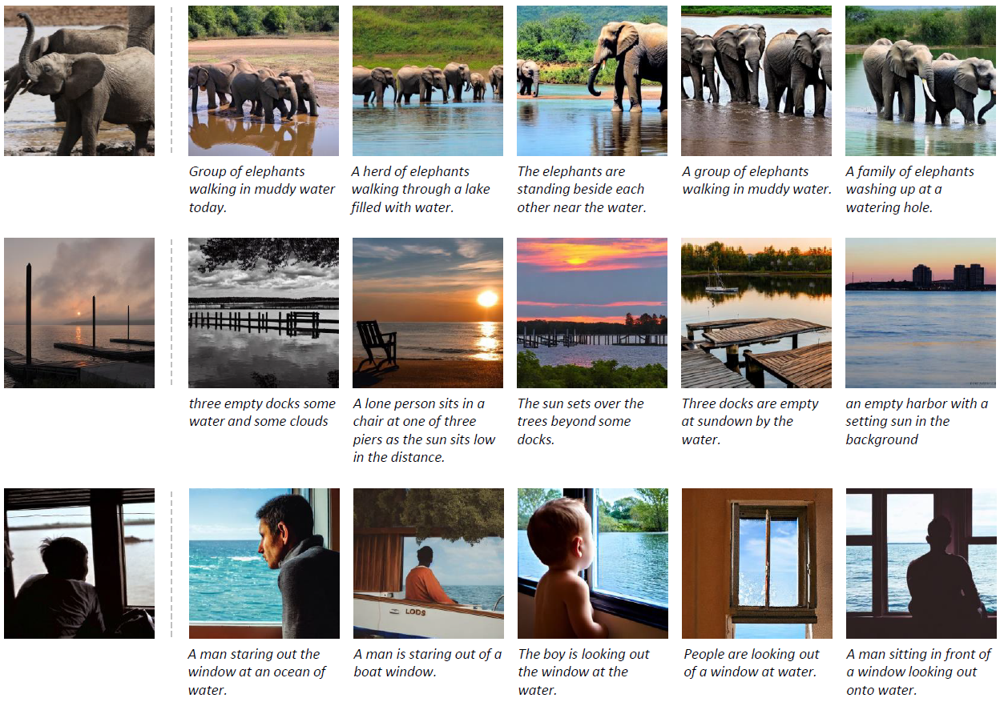

# COCOFake

This repository presents the deepfake detection dataset proposed in:

*R. Amoroso\*, D. Morelli\*, M. Cornia, L. Baraldi, A. Del Bimbo, R. Cucchiara* </br>
**Parents and Children: Distinguishing Multimodal DeepFakes from Natural Images** </br>

**\*** Equal contribution.

[](https://arxiv.org/abs/2304.00500)

## Dataset Details

The dataset consists of more than 1.2M images generated by Stable Diffusion v1.4 and v2.0, using textual prompts coming from the COCO dataset for image captioning. As such, it contains clusters of five generated images sharing the same semantics and generated from five different textual prompts. In comparison with existing datasets for deep fake detection, it features more diversity, uniform coverage of semantic classes, and can easily be expanded to a larger scale.

The Stable Diffusion v1.4 version of the dataset is available for download at: https://ailb-web.ing.unimore.it/releases/fake_coco.tar.gz.

<p align="center">
    
</p>

## Citation

If you make use of our dataset, please cite our paper:

```bibtex
@article{amoroso2023parents,
  title={Parents and Children: Distinguishing Multimodal DeepFakes from Natural Images},
  author={Amoroso, Roberto and Morelli, Davide and Cornia, Marcella and Baraldi, Lorenzo and Del Bimbo, Alberto and Cucchiara, Rita},
  journal={arXiv preprint arXiv:2304.00500},
  year={2023}
}
```

## Acknowledgements

This work has been supported by the Horizon Europe project "European Lighthouse on Safe and Secure AI (ELSA)" (HORIZON-CL4-2021-HUMAN-01-03), co-funded by the European Union, and by the PNRR project "Future Artificial Intelligence Research (FAIR)", co-funded by the Italian Ministry of University and Research.
